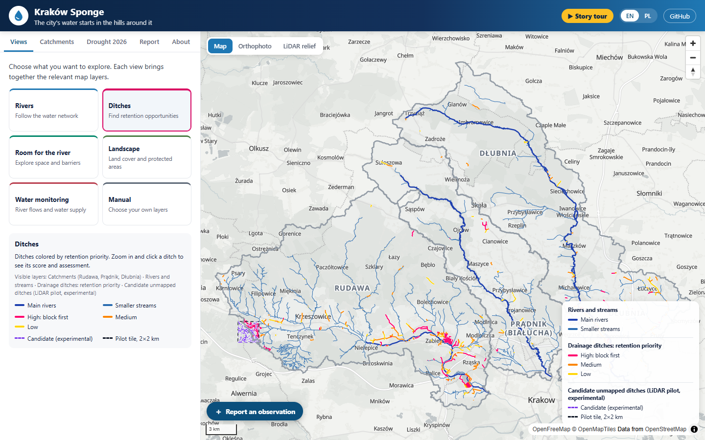
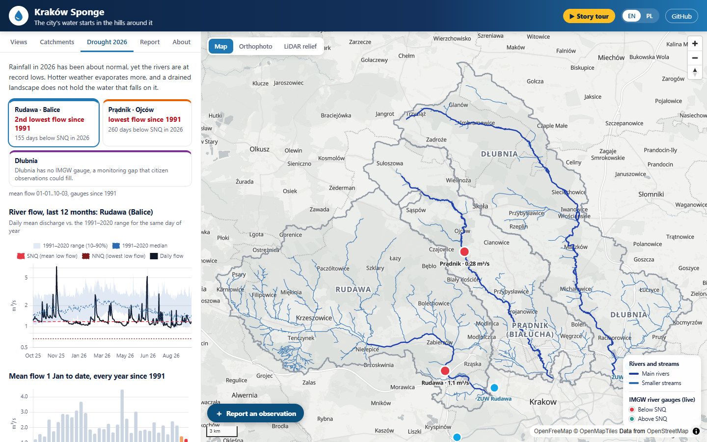
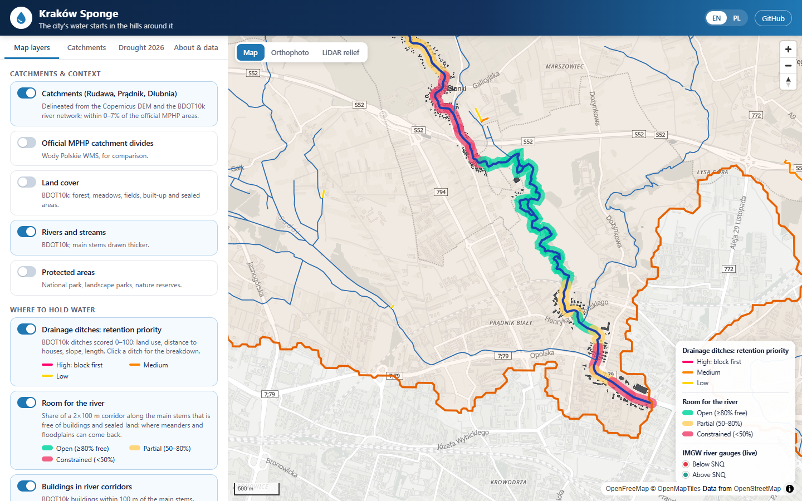
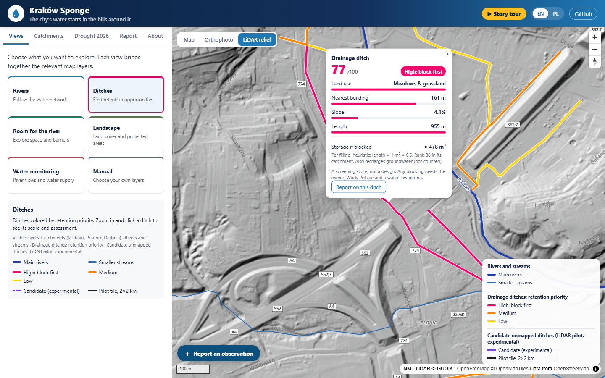
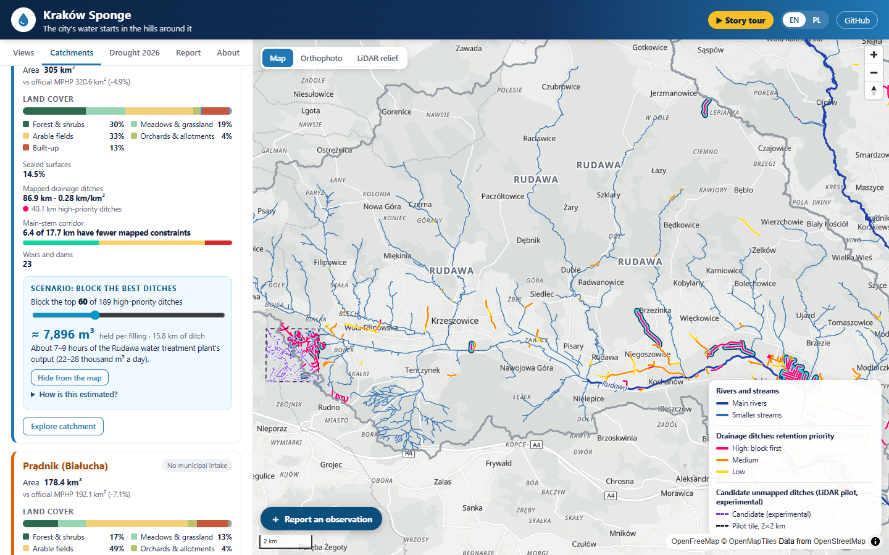
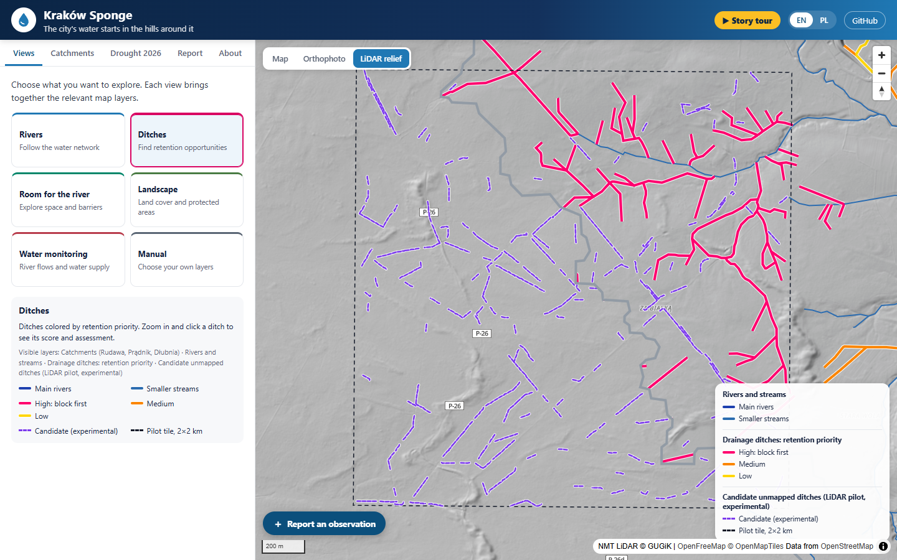
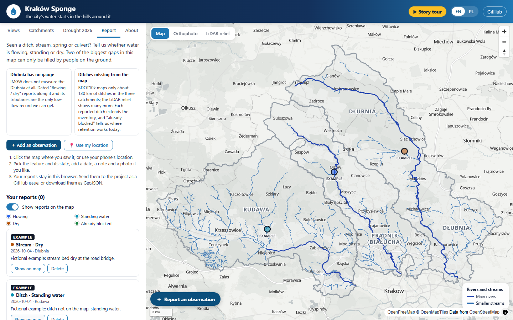
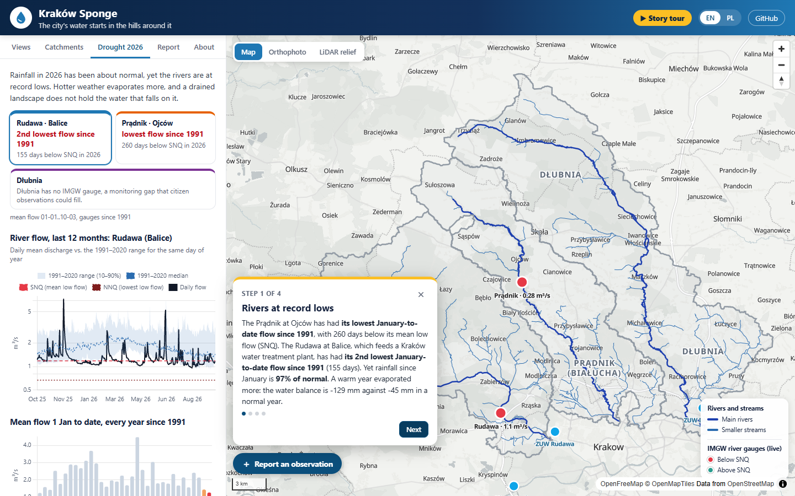
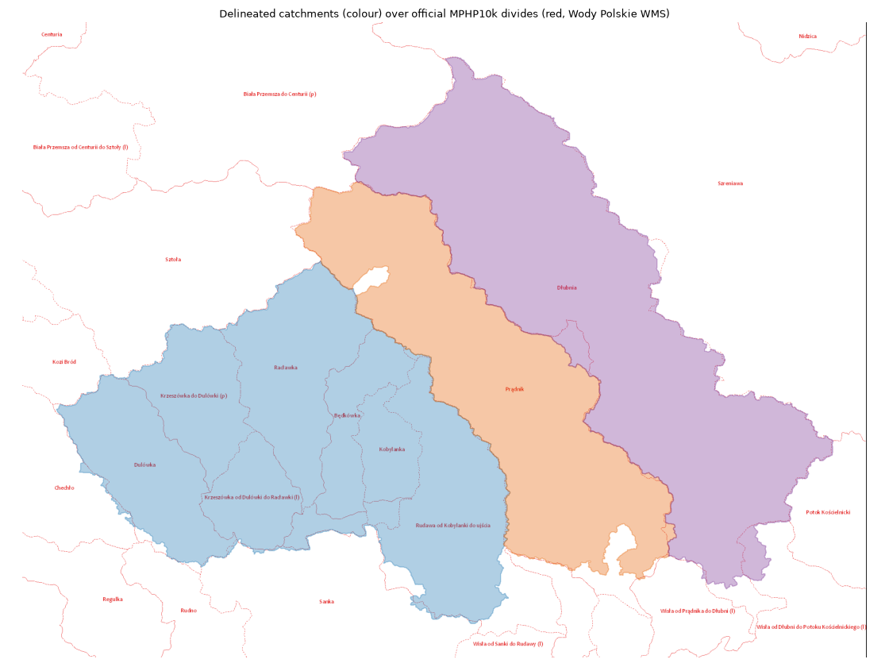
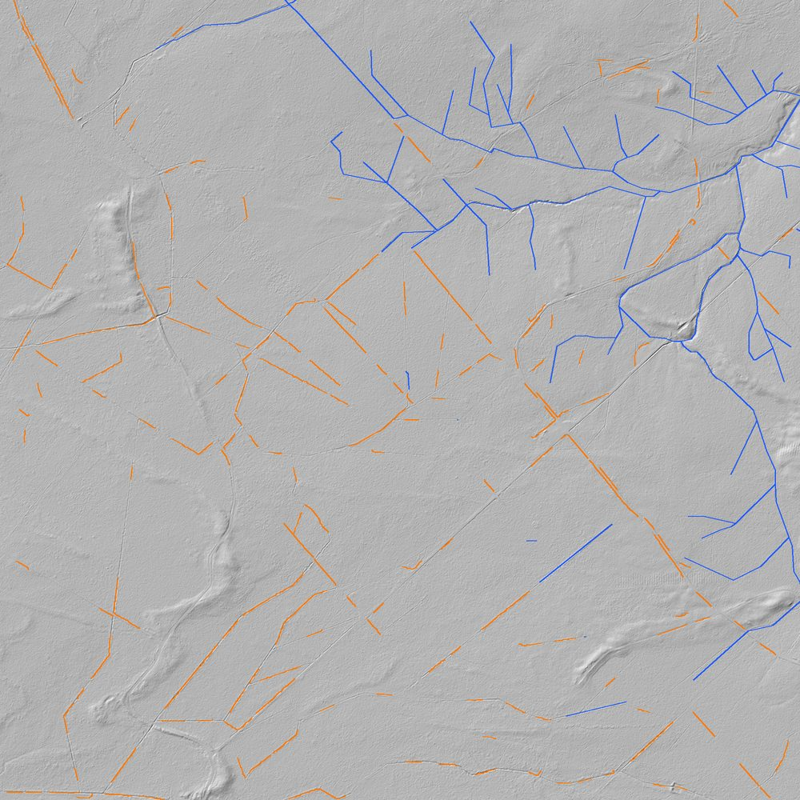

# Kraków Sponge: the city's water starts in the hills around it

**Kraków Sponge** (Gąbka Krakowa) is an open-data map and drought dashboard for the three small rivers that flow into Kraków from the north and west: the **Rudawa**, the **Prądnik (Białucha)** and the **Dłubnia**. Two of them supply the city's tap water. It shows where water could be held back in the landscape: drainage ditches worth blocking first, and river reaches with room to meander. It also shows how badly these rivers are doing in the 2026 drought.

**Live demo:** https://piotrnowakowski.github.io/Krakow_sponge_around_city/

Built for the [OneAquaHealth IEEE Global Hackathon 2026](https://oneaquahealth-ieee-hackathon.devpost.com/).



## Track alignment

**Primary track: Resilience Informatics.** The app combines a drought early-warning view (live IMGW gauges and warnings, 35 years of flow records, ERA5 water balance) with retention planning: which ditches to block first and where rivers have room to meander.

It also covers **Data-to-Insight**, because it turns raw national datasets (BDOT10k, DEM, IMGW, ERA5) into a few decisions per catchment, and **Citizen Science UX**: residents can report ditches, streams, springs and culverts as flowing, standing, dry or already blocked, right where official data are missing. Dłubnia, for example, has no IMGW gauge at all.

**One Health link:** low flows mean warmer, less oxygenated water, higher pollutant concentrations, fish kills and risk to drinking-water intakes. These are urban freshwater health problems whose cause lies upstream, outside the city.

## The problem

Kraków takes about 97% of its tap water from rivers. The **Rudawa** feeds the Rudawa water treatment plant (weirs at Mydlniki and Szczyglice) and the **Dłubnia** feeds the Dłubnia plant. The **Prądnik** runs through the Ojców National Park and then through the city.

In 2026, Poland had a severe hydrological drought. Researchers point to lost **retention**: decades of drainage ditches in fields and forests, sealed surfaces and straightened, concreted channels move water out of the landscape too fast. A *sponge city* needs a sponge landscape around it.

## What the data say (as of 3 October 2026)

| | Rudawa (Balice gauge) | Prądnik (Ojców gauge) | Dłubnia |
|---|---|---|---|
| Mean flow, 1 Jan to 3 Oct 2026 | **2nd lowest since 1991** (1.26 m³/s; only 1991 was lower) | **lowest since 1991** (0.27 m³/s) | no IMGW gauge |
| Days below SNQ (mean low flow) in 2026 | 155 | 260 | – |
| Rainfall since 1 Jan (ERA5) | 97% of 1991–2020 normal | 101% | 101% |
| Climatic water balance (rain − ET₀) | −129 mm (normal −45 mm) | −130 mm (normal −78 mm) | −135 mm (normal −82 mm) |
| Arable land / forest | 33% / 30% | 49% / 17% | 63% / 12% |
| Sealed surfaces | 14.5% | 16.7% | 12.0% |
| Drainage ditches in BDOT10k | 87 km (40 km high priority) | 11 km | 32 km |
| Main-stem screening: fewer mapped constraints (updated 4 October) | 6.4 of 17.8 km | 8.5 of 38.5 km | 12.4 of 56.2 km |

An IMGW **hydrological drought warning for the Rudawa and Prądnik catchments** has been active since **4 July 2026**.

The key insight is that **rainfall was about normal, yet the rivers hit record lows.** Higher evaporation, together with a landscape that sheds water instead of storing it, empties the groundwater that keeps rivers flowing in summer. Retention measures (blocking ditches, restoring meanders and floodplains, unsealing) target exactly this.



## Features

- **Three catchments delineated from open data** and validated against the official MPHP10k map.
- **Land cover** per catchment from BDOT10k: forest, meadows, arable land, orchards, built-up, industrial and transport areas.
- **Drainage ditch priority score (0–100)** for every BDOT10k ditch, with a click-through breakdown:
  - land use (forest or meadow 40, arable 25, built-up 0)
  - distance to the nearest building (no points below 50 m, full points from 200 m)
  - slope (flat ditches hold more water per dam)
  - length

  This is a transparent screening heuristic, not a hydrological model. Blocking any ditch needs the owner, Wody Polskie and a water-law permit.
- **Retention potential, a transparent estimate:** every ditch popup shows roughly how much water it would hold if blocked, and each catchment card has a scenario slider, "block the top N high-priority ditches", that adds up the volume, highlights those ditches on the map and compares the total with the Rudawa water treatment plant's daily output. For the Rudawa catchment, blocking all 189 high-priority ditches (40 km) holds about **20,000 m³ per filling, roughly 17–22 hours of the plant's production**. See [Retention estimate](#retention-estimate) for the assumptions.
- **LiDAR ditch detection, an experimental pilot:** in one 2×2 km tile of drained forest west of Krzeszowice, narrow linear depressions are detected automatically in the 1 m GUGiK LiDAR terrain model, and everything within 10 m of a mapped ditch or river is removed. The result, **12.5 km of candidate unmapped ditches next to 11.4 km of mapped ditches and streams**, is a separate, clearly labelled map layer. See [LiDAR pilot](#lidar-pilot-experimental).
- **Room for the river:** conservative screening on segments no longer than 50 m, combining the unbuilt/unsealed share of a corridor extending 100 m on each side with the shortest distance from the whole mapped river centreline segment to a building footprint. Red means a building within 30 m **or** at least 50% built/sealed area; amber means a building within 100 m **or** less than 80% unbuilt/unsealed area; green means fewer mapped constraints. Building proximity overrides the area average, including near reach endpoints. The 30 m / 100 m thresholds are app heuristics, not legal setbacks, surveyed bank clearances, or proof that restoration is feasible. Missing buildings, roads, embankments, terrain and land ownership still need local assessment. This replaces the former 250 m area-only score, which could show a built-up riverside as yellow or green.

  Rebuild the layer and catchment totals from cached source data with `python pipeline/rebuild_corridors.py`; run geometry regressions with `python -m unittest discover -s pipeline -p test_corridors.py`.
- **Free sections and calculated bends:** the "Only free sections" filter shows green reaches without repainting excluded sections with the river overlay. Choose one of 23 connected candidate sections to compare the current channel (dashed blue) with a calculated bend concept (purple), including measured lengths, percentage gain and lateral offset. The concepts keep both endpoints and avoid mapped exclusion areas. They do not establish land availability, reconstruct historic channels or predict flood reduction. See [calculation and validation](docs/meander-concepts.md).
- **Live IMGW gauges and drought warnings** fetched directly in the browser, with 12-month hydrographs against the 1991–2020 range and SNQ/NNQ thresholds.
- **Year ranking:** mean flow from 1 January to date for every year since 1991, from the verified IMGW archive.
- **ERA5 climate panel:** cumulative climatic water balance 2026 vs 2025 vs normal, monthly rainfall, and soil moisture anomaly.
- **Citizen reports:** click the map (or use your phone's location), pick ditch / stream / spring / culvert and flowing / standing water / dry / already blocked, add a date, a note and a photo. Reports are kept in the browser (localStorage; photos are shrunk to a 480 px JPEG thumbnail), shown as their own map layer, and leave the browser only when you choose: **Export GeoJSON** or **Send to project**, which opens a prefilled GitHub issue on this repository with the reports as a table and GeoJSON (photos are attached by hand, since they do not fit in a link). No backend, no API keys. Fictional example reports can be switched on to try it out; they are labelled EXAMPLE and never exported or sent.
- **Basemaps:** vector map, GUGiK orthophoto and **LiDAR shaded relief**. On the relief, the many ditches missing from BDOT10k are clearly visible.
- **Official MPHP divides** overlay, protected areas, weirs and dams, and buildings in river corridors.
- **Story tour:** a 5-step guided walk-through (drought numbers → catchments → ditches → room for the river → calculated bends), offered on the first visit and available from the "Story tour" button. Step 5 enables the free-sections filter and zooms to a measured bend concept. Its numbers come from the generated data.
- **English and Polish** interface; works on phones and tablets; keyboard navigable (tabs follow the WAI-ARIA pattern, visible focus rings, skip link); an axe-core scan of every tab, the tour and the report form reports no WCAG 2.1 A/AA violations.
- **Light first load:** the land-cover layer (the largest file, ~1.9 MB gzipped) is only downloaded when a view that shows it is opened.

| Room for the river (Prądnik in Kraków) | Ditch score on the LiDAR relief |
|---|---|
|  |  |
| **Retention scenario: top 60 high-priority Rudawa ditches** | **LiDAR pilot: candidate unmapped ditches (experimental)** |
|  |  |
| **Citizen reports (fictional examples, labelled EXAMPLE)** | **Story tour, step 1** |
|  |  |

**Hackathon submission:** [Devpost text](docs/devpost.md) · [demo video script](docs/demo-script.md) (the walkthrough is recorded from the live site with `tools/record-demo.mjs`).

## How it works

```
pipeline/                    Python, writes web/public/data/*.json
  download.py      BDOT10k county packages (GUGiK) + Copernicus GLO-30 DEM tiles
  catchments.py    DEM -> burned streams -> D8 flow -> catchment labels from MPHP-coded rivers
  validate.py      overlays the result on the official MPHP10k WMS (docs/validation_mphp.png)
  layers.py        land cover, rivers, ditch scores, corridors, buildings, weirs, stats.json
  retention.py     storage estimate per ditch, per-catchment ranking, retention.json
  lidar_pilot.py   EXPERIMENTAL: candidate unmapped ditches from the 1 m LiDAR DTM, one pilot tile
  lidar_check.py   contact sheet of 30 random candidates for checking precision by eye
  drought.py       IMGW operational + archive discharge, IMGW warnings, ERA5 via Open-Meteo
  run_all.py       runs everything
web/                         Vite + MapLibre GL + Chart.js static site
.github/workflows/deploy.yml builds the site, refreshes drought data daily, deploys to Pages
```

### Catchment delineation

The official MPHP10k catchment polygons are published only as a WMS picture, so the catchments are rebuilt from open data:

1. Mosaic the Copernicus GLO-30 DEM and reproject it to EPSG:2180 at 25 m.
2. Burn the BDOT10k rivers 10 m into the surface. GLO-30 is a surface model, so bridges and buildings would otherwise block the channels.
3. Fill depressions, resolve flats and compute D8 flow directions (pysheds).
4. Give every cell the MPHP code of the first BDOT10k river it drains into. Inside Kraków, only 11% of river segments carry a code, so codes are first copied along same-named rivers. This mirrors how MPHP itself hangs catchments off the coded river network, and it is robust to DEM routing errors in the flat Krzeszowice graben.

| Catchment | This app | Official MPHP10k | Difference |
|---|---|---|---|
| Rudawa (2136) | 305.0 km² | 320.6 km² | −4.9% |
| Prądnik (21374) | 178.4 km² | 192.1 km² | −7.1% |
| Dłubnia (21376) | 272.7 km² | 273.1 km² | −0.2% |

Most of the remaining difference is in the lowest, urban reaches, where rivers run in culverts.



### Retention estimate

`pipeline/retention.py` adds a storage estimate to every BDOT10k ditch. It is a heuristic, not a hydraulic model:

```
volume [m³] = length [m] × cross-section [m²] × fill factor
            = length × 1.0 × 0.5  ->  0.5 m³ per metre of ditch
```

- **Cross-section 1.0 m²:** a typical small field ditch, about 0.5 m wide at the bottom and 0.8 m deep with 1:1 side slopes ((0.5 + 0.8) × 0.8 ≈ 1.0 m²). BDOT10k has no ditch dimensions, so every ditch gets the same profile.
- **Fill factor 0.5:** a chain of small dams holds water at full depth just upstream of each dam, tapering to nothing at the next dam upstream, so on average about half of the channel is full.
- **Per filling:** a blocked ditch refills after each rain, so the seasonal effect is larger than one filling.
- **Groundwater recharge is not counted.** Water held in a ditch soaks into the soil and raises the water table along it. That recharge sustains summer base flow and is probably the bigger benefit, but estimating it needs soil and groundwater data we do not have.
- **Ranking:** within each catchment, ditches are ranked by their priority score (longer first on ties). The scenario slider walks down that list.
- **Reference:** the Rudawa water treatment plant (ZUW Rudawa) currently produces **22,000–28,000 m³ per day** (maximum capacity 55,000 m³/day), according to Wodociągi Miasta Krakowa's [technical leaflet for ZUW Rudawa](https://wodociagi.krakow.pl/admin/files/Files/foldery_ulotki/WMK-ulotka_schemat_techniczno-organizacyjny_ZUW_Rudawa.pdf).

| Catchment | High-priority ditches | Length | Held per filling (top N = all high) | All mapped ditches |
|---|---|---|---|---|
| Rudawa | 189 | 40.1 km | ≈ 20,100 m³ | ≈ 43,500 m³ |
| Prądnik | 7 | 2.2 km | ≈ 1,100 m³ | ≈ 5,500 m³ |
| Dłubnia | 21 | 6.8 km | ≈ 3,400 m³ | ≈ 16,200 m³ |

These are small numbers next to a river, and that is the honest point: one blocked ditch is a drop, but there are many more ditches than BDOT10k shows, and the real gain is the water that soaks in and keeps the river flowing in August.

### LiDAR pilot (experimental)

`pipeline/lidar_pilot.py` looks for ditches that BDOT10k does not map, in one 2×2 km tile (EPSG:2180 538000–540000 E, 250000–252000 N; a drained forest in the Rudawa catchment with a dense mapped ditch network on one side and many unmapped linear features on the other):

1. Download the **GUGiK 1 m DTM** (NMT) for the tile plus a 50 m margin from the GUGiK WCS (`DTM_PL-KRON86-NH_TIFF`).
2. **Black top-hat:** grey closing of the lightly smoothed DTM with a 9 m disc, minus the DTM. This is how far each cell sits below its surroundings, but only for depressions narrower than the disc, so valleys and hollows drop out and narrow channels stand out. Forest ditches here are only 0.1–0.3 m deep in this measure.
3. **Hysteresis threshold** (cells ≥ 0.10 m deep kept when connected to cells ≥ 0.20 m deep), bridge 1–2 m gaps, drop blobs under 60 m² and blobs wider than 4 m on average (pits, ponds).
4. **Skeletonise** and trace the skeleton into lines; keep lines of 30 m or more.
5. **Remove** every part within 10 m of a BDOT10k ditch or river.



**How good is it?**
- **Precision, checked by eye:** `pipeline/lidar_check.py` draws 30 random candidates on the 1 m relief ([contact sheet](docs/lidar_pilot_check.jpg)). 27 of 30 follow a narrow linear depression clearly visible on the relief, 2 follow nothing visible and 1 is unclear. The relief alone cannot tell a ditch from a wheel rut or a drain along a forest road, and several candidates are one of a parallel pair along a forest track. So "a real linear depression" is about 90%; "a real drainage ditch" is lower and unknown until someone checks on the ground, which is what the citizen reports are for.
- **Recall on the mapped network:** the detector finds 41% of the BDOT10k ditches and streams in the tile (within 5 m). Some mapped ditches are shallow or silted up, and some BDOT10k lines sit a few metres off the channel.

It is a pilot: one tile, parameters tuned by eye, no field validation. Scaling it to the three catchments means about 750 km² of 1 m DTM, which is feasible but has not been done.

## Run it yourself

```bash
# data pipeline (Python 3.12)
python -m venv .venv && .venv/Scripts/activate      # or source .venv/bin/activate
pip install -r pipeline/requirements.txt
cd pipeline && python run_all.py                     # ~10 min, ~350 MB of downloads cached in data/raw

# web app (Node 20+)
cd web && npm install && npm run dev                 # http://localhost:5173
```

The processed data are committed in `web/public/data`, so the web app runs without the pipeline. `pipeline/drought.py` can be run on its own to refresh the drought numbers.

Browser checks (Playwright, in `tools/`): `cd tools && npm install`, start the dev server, then e.g. `node check.mjs http://127.0.0.1:5173/` (console errors plus desktop and mobile screenshots), `node test-reports.mjs`, `node test-retention.mjs`, `node test-lidar.mjs`, `node test-tour.mjs`, `node test-a11y.mjs` (axe-core) or `node test-mobile.mjs`. `node make-og.mjs` rebuilds the social preview image `web/public/og.png`.

## Data sources and licences

| Data | Provider | Use |
|---|---|---|
| BDOT10k topographic database | GUGiK, [geoportal.gov.pl](https://www.geoportal.gov.pl/pl/dane/baza-danych-obiektow-topograficznych-bdot10k/), free re-use | rivers, ditches, land cover, buildings, weirs, protected areas |
| Copernicus GLO-30 DEM | ESA / Airbus; © DLR e.V. 2010–2014 and © Airbus Defence and Space GmbH 2014–2018, provided under COPERNICUS by the EU and ESA | catchment delineation, slope |
| MPHP10k hydrographic map | PGW Wody Polskie (WMS) | validation, overlay |
| Hydrological data and warnings | IMGW-PIB ([danepubliczne.imgw.pl](https://danepubliczne.imgw.pl), [hydro.imgw.pl](https://hydro.imgw.pl)) | discharge, thresholds, warnings |
| ERA5 reanalysis | Copernicus Climate Change Service, via [Open-Meteo](https://open-meteo.com) (CC BY 4.0) | rainfall, ET₀, soil moisture |
| Orthophoto and LiDAR shaded relief | GUGiK WMS | basemaps |
| NMT 1 m LiDAR digital terrain model | GUGiK, [WCS](https://mapy.geoportal.gov.pl/wss/service/PZGIK/NMT/GRID1/WCS/DigitalTerrainModelFormatTIFF), free re-use | LiDAR ditch pilot |
| Basemap | [OpenFreeMap](https://openfreemap.org), © OpenMapTiles, © OpenStreetMap contributors | basemap |
| Water treatment plant locations | © OpenStreetMap contributors (ODbL) | map markers |
| ZUW Rudawa production (22–28 thousand m³/day) | Wodociągi Miasta Krakowa, [technical leaflet](https://wodociagi.krakow.pl/admin/files/Files/foldery_ulotki/WMK-ulotka_schemat_techniczno-organizacyjny_ZUW_Rudawa.pdf) | retention scenario reference |

## Limitations

- Catchments come from a 25 m surface model; the lower urban reaches are underestimated.
- BDOT10k maps only the larger ditches, and no field tile drains. The real drainage network is much denser; see the LiDAR relief.
- The ditch score and the corridor index are screening tools for a conversation with landowners, Wody Polskie and the city, not engineering designs.
- ERA5 cells are about 25 km wide, so Prądnik and Dłubnia share a climate cell.
- IMGW 2026 discharge is operational, not yet verified. It matches the verified archive within 0.3% over the October 2025 overlap.

## Roadmap

1. **Citizen reports, phase 2:** a small moderated store (e.g. GitHub issues → GeoJSON in the repo via an Action) so that everyone's reports appear on the map, not only your own.
2. **LiDAR ditch detection beyond the pilot:** run the detector over all three catchments, separate forest-road ruts from ditches (road data, orthophoto), and let residents confirm candidates on the ground.
3. **Groundwater:** PIG-PIB monitoring wells and Copernicus soil-moisture anomaly layers.
4. **Retention potential, phase 2:** floodplain storage for the "room for the river" reaches, and a groundwater-recharge estimate once soil and well data are in.
5. **Renaturalisation support:** link corridor reaches to the Wody Polskie Dłubnia renaturalisation concept and to the national renaturalisation programme (KPRWP).

## Licence

Code: [MIT](LICENSE). Data remain under their providers' licences (see above).

---

### Po polsku w skrócie

**Gąbka Krakowa** to mapa i panel suszy dla zlewni Rudawy, Prądnika i Dłubni. Pokazuje, które rowy melioracyjne warto zablokować najpierw, gdzie rzeki mają miejsce na meandry i jak głęboka jest susza 2026. Prądnik w Ojcowie ma najniższy przepływ od 1991 r., a Rudawa w Balicach drugi najniższy, mimo opadów w normie. Woda dla Krakowa zaczyna się na polach i w lasach wokół miasta.
